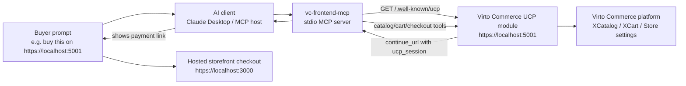

# Virto Commerce UCP MCP

Model Context Protocol server for Virto Commerce UCP. It lets an AI client discover a Virto Commerce UCP-enabled platform, search catalog products, assemble carts, prepare checkout data, and hand the buyer off to the hosted storefront checkout.

The MCP server is intentionally thin. Business rules stay in Virto Commerce and the UCP module; this package translates MCP tool calls into UCP REST calls and returns structured JSON back to the agent.

## What It Does

- Discovers UCP capabilities through `/.well-known/ucp`.
- Supports catalog search and product detail lookup.
- Creates, reads, lists, and updates UCP carts.
- Creates checkout snapshots and hosted storefront handoff links.
- Sends structured shipping and billing addresses to UCP instead of stuffing addresses into notes.
- Resolves countries and regions through Virto Commerce platform geography endpoints.
- Remembers the active UCP base URL, discovered store id, storefront URL, and the last checkout in local state files.
- Discovers storefront origin from UCP profile data or from the handoff `continue_url`.

## Architecture



## Autodiscovery

The user can mention only the UCP/platform URL:

```text
Купи мне кипятильник на https://localhost:5001
```

The agent should pass that URL as `base_url` on the first MCP tool call. The MCP server stores it in a local context file and uses it for later calls.

Store id priority:

1. Tool `store_id` argument.
2. `UCP_STORE_ID` environment variable.
3. UCP discovery response (`default_store_id`, `store.id`, an explicitly default `stores[]` entry, or the only `stores[]` entry).
4. No guess: if discovery returns multiple stores without a default, UCP returns `missing_store_id` until the agent passes an explicit `store_id`.

Storefront URL priority:

1. `UCP_STOREFRONT_URL` environment variable or tool `storefront_url` argument.
2. UCP discovery response (`storefront_origin`, future `storefront.url`, or `endpoints.handoff_url_template` origin).
3. Handoff response `checkout.continue_url` origin.
4. No guess: the MCP response exposes missing context instead of inventing a storefront URL.

The MCP server does not build checkout links by guessing. The authoritative buyer link is the UCP handoff `continue_url`.

## Requirements

- Node.js 22 or newer.
- Virto Commerce platform with the UCP module installed.
- A storefront capable of restoring `ucp_session` handoff links.

## Build

```powershell
cd C:\Source\vc-frontend-mcp
npm install
npm run build
```

## Claude Desktop Config

Minimal local config:

```json
{
  "mcpServers": {
    "vc-ucp": {
      "command": "node",
      "args": ["C:\\Source\\vc-frontend-mcp\\dist\\index.js"],
      "env": {
        "UCP_CURRENCY": "USD",
        "UCP_LANGUAGE": "en-US",
        "UCP_ALLOW_SELF_SIGNED": "true"
      }
    }
  }
}
```

## Configuration

| Variable | Default | Description |
| --- | --- | --- |
| `UCP_BASE_URL` | `https://localhost:5001` | Virto Commerce platform/UCP origin. Can also be supplied per tool as `base_url`. |
| `UCP_STOREFRONT_URL` | empty | Optional explicit storefront origin override. Usually not needed when UCP handoff returns `continue_url`. |
| `UCP_STORE_ID` | empty | Optional explicit Virto store id override. Usually discovered from UCP profile `default_store_id` / `store.id`. |
| `UCP_CURRENCY` | `USD` | Default currency. |
| `UCP_LANGUAGE` | `en-US` | Default culture/language. |
| `UCP_ALLOW_SELF_SIGNED` | `true` | Allows local HTTPS certificates. Set to `false` outside trusted local/dev environments. |
| `UCP_BEARER_TOKEN` | empty | Optional bearer token for secured UCP endpoints. |
| `UCP_MCP_STATE_FILE` | `%USERPROFILE%\.vc-frontend-mcp\last-checkout.json` | Last checkout state used by follow-up tools. |
| `UCP_MCP_CONTEXT_FILE` | `%USERPROFILE%\.vc-frontend-mcp\context.json` | Active UCP/storefront discovery context. |

## Tools

- `get_store_capabilities`
- `list_countries`
- `resolve_country`
- `list_regions`
- `search_products`
- `get_product`
- `create_cart`
- `list_carts`
- `get_cart`
- `update_cart`
- `create_checkout`
- `update_checkout`
- `get_payment_handlers`
- `handoff_checkout`
- `checkout_and_handoff`
- `track_order`
- `track_last_order`

Every business tool accepts optional `base_url`, `storefront_url`, and `store_id` when relevant. Use `base_url` when the buyer mentions a specific Virto Commerce platform URL in the prompt. Omit `store_id` when UCP discovery returns `default_store_id` or `store.id`.

## Checkout Flow

1. `get_store_capabilities` discovers UCP profile and agent guidance.
2. `search_products` finds candidates.
3. `get_product` inspects details and attributes.
4. `create_cart` creates the cart.
5. `update_cart` changes quantities, adds items, removes items, or applies coupons.
6. `resolve_country` and `list_regions` normalize address country/region through platform dictionaries.
7. `checkout_and_handoff` creates checkout and returns hosted storefront `continue_url`.
8. Buyer completes delivery method and payment in the storefront.

Delivery method and payment selection are intentionally left to hosted checkout until UCP exposes those flows as stable tools.

## Address Rules

When the buyer gives a delivery address, the agent must send it as structured fields:

```json
{
  "shipping_address": {
    "first_name": "Jane",
    "last_name": "Buyer",
    "email": "jane.buyer@example.com",
    "country_code": "USA",
    "country_name": "United States",
    "region": "Washington",
    "city": "Seattle",
    "line1": "1 Main St",
    "line2": "Apt 100",
    "postal_code": "98101"
  },
  "billing_address": {
    "same_as_shipping": true
  }
}
```

Important rules:

- Do not put shipping or delivery addresses into `notes`.
- Resolve country through `resolve_country`; for United States, platform id is usually `USA`, not `US`.
- Resolve province/region through `list_regions` when the country has regions.
- City remains a free-text field.
- `postal_code` is required by the hosted address edit form.
- `first_name`, `last_name`, and `email` are strongly recommended for guest checkout UX.

## Example Prompts

Buy by platform URL:

```text
Use vc-ucp. Buy me the best orange iPhone on https://localhost:5001, quantity 20, add one top Samsung, and prepare checkout.
```

Checkout with address:

```text
Use vc-ucp. Checkout cart "<cart-id>" with delivery to United States, Seattle, 1 Main St, Apt 100, postal code 98101. Resolve country and region through UCP geography tools, then return the handoff continue_url.
```

Change address before payment:

```text
Use vc-ucp. Update checkout "<checkout-id>" with the new structured shipping address, then call handoff_checkout again and return the fresh continue_url.
```

## Local State

The MCP server stores small local JSON files:

- `context.json`: active `ucp_base_url`, discovered `store_id`, discovered `storefront_url`, source fields, and handoff template.
- `last-checkout.json`: last cart/checkout ids and buyer context.

These files are local runtime state and must not be committed.

## Publishing Readiness

Current status: useful for GitHub review, not yet a polished public package.

Before publishing publicly:

- Decide and set the repository license.
- Decide whether order tracking tools belong in this release or a later PR.
- Add CI for `npm ci` and `npm run check`.
- Add examples for ChatGPT remote MCP only after an HTTP transport is added.
- Consider splitting the single `src/index.ts` into config, UCP client, state, and tools modules.
- Verify no local URLs, tokens, or state files are committed.

## Development

```powershell
npm run check
npm run build
```

Run from source during development:

```powershell
npm run dev
```
